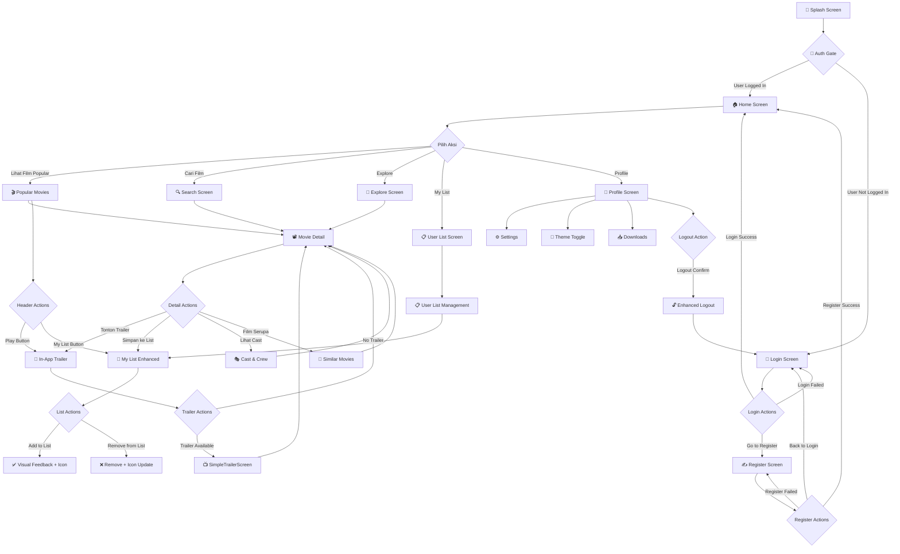
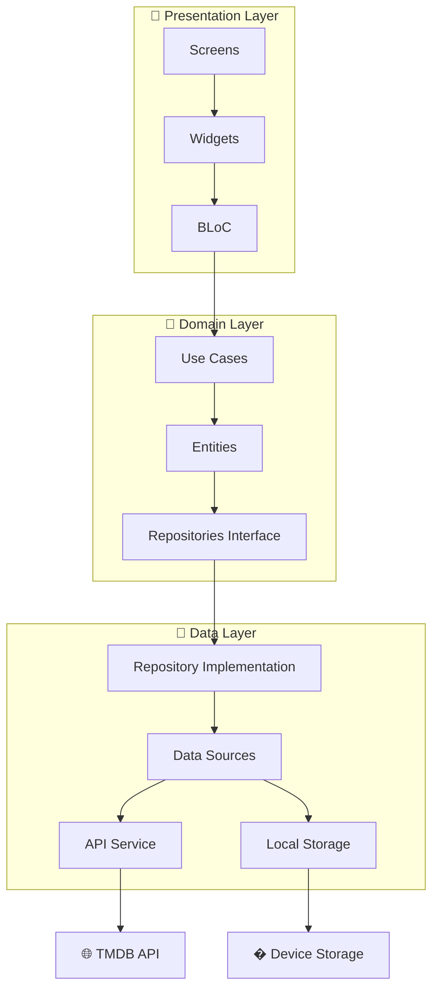
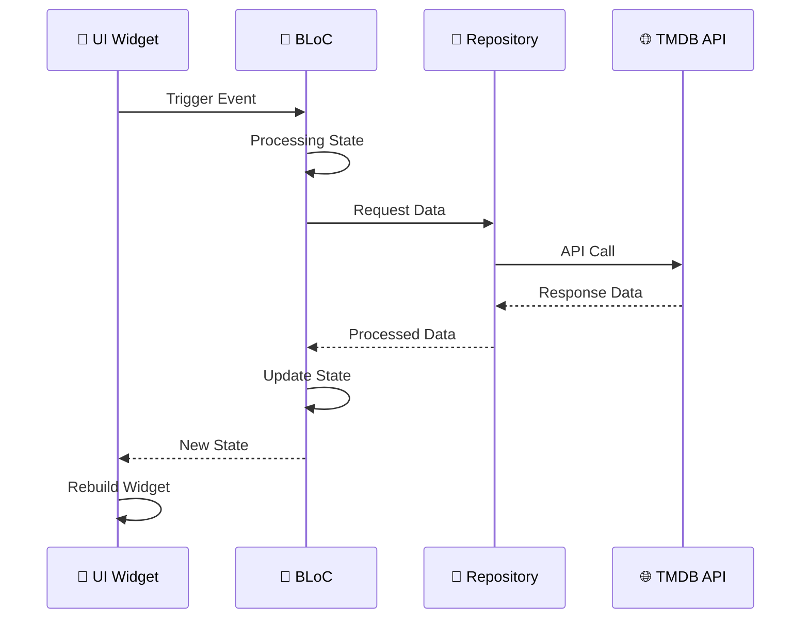
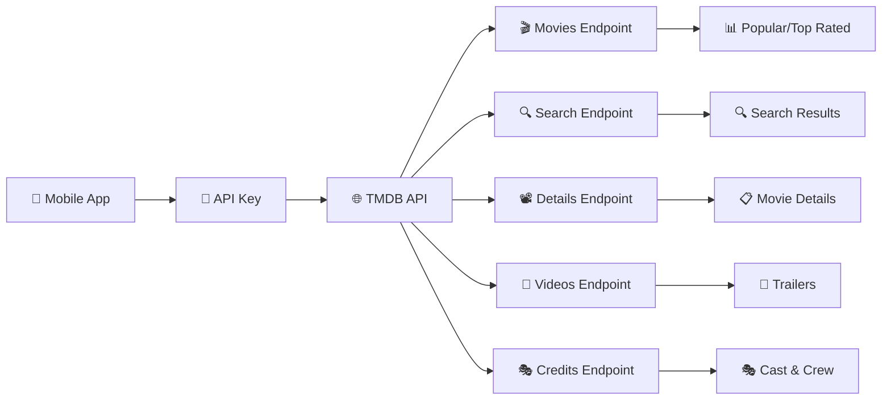
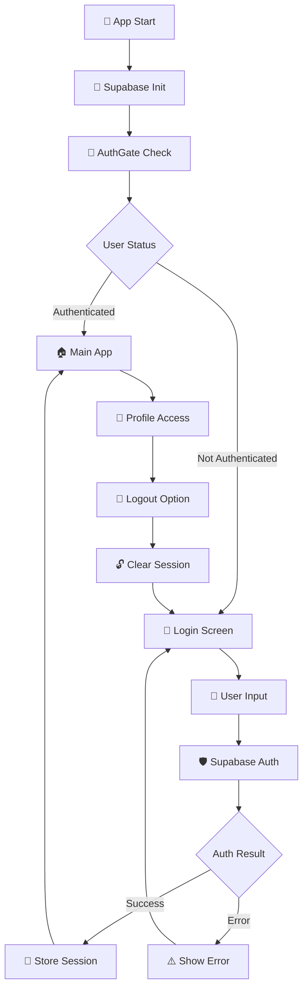

# 🎬 Movie UI Application

<div align="center">


### 🚀 Aplikasi Movie UI Modern dengan Flutter & TMDB API
*Pengalaman Menonton Film Terdepan dengan Teknologi Terkini*

[](https://flutter.dev/)
[](https://dart.dev/)
[](https://www.themoviedb.org/)
[](https://bloclibrary.dev/)
[](https://supabase.com/)
[](LICENSE)

**⭐ Beri Star jika project ini bermanfaat! ⭐**

</div>

---

## 📋 Daftar Isi

- [🎯 Tentang Proyek](#-tentang-proyek)
- [✨ Fitur Unggulan](#-fitur-unggulan)
- [🎮 User Flow](#-user-flow)
- [🏗️ Arsitektur Sistem](#️-arsitektur-sistem)
- [📁 Struktur Folder](#-struktur-folder)
- [📱 Screenshots](#-screenshots)
- [� Sistem Authentication](#-sistem-authentication)
- [�🛠️ Instalasi](#️-instalasi)
- [🚀 Quick Start](#-quick-start)
- [⚡ Teknologi](#-teknologi)
- [🤝 Kontribusi](#-kontribusi)
- [🛠️ Troubleshooting](#️-troubleshooting)

---

## 🎯 Tentang Proyek

**Movie UI Application** adalah aplikasi mobile modern yang dibangun dengan **Flutter** dan terintegrasi dengan **TMDB (The Movie Database) API** serta **Supabase** untuk authentication. Aplikasi ini menyediakan pengalaman menonton film yang luar biasa dengan antarmuka yang elegan, sistem authentication yang aman, dan fitur-fitur canggih.

### 🌟 Keunggulan Utama
- 🔐 **Authentication System**: Sistem login/register aman dengan Supabase backend
- 🎨 **UI/UX Modern**: Desain antarmuka yang elegan dan user-friendly
- ⚡ **Performa Tinggi**: Optimasi dengan BLoC pattern dan caching gambar
- 🌐 **Multi-API Integration**: TMDB untuk data film, Supabase untuk user management
- 📱 **Multi-platform**: Mendukung Android, iOS, Web, dan Windows
- 🎥 **Fitur Personal**: Personal movie lists, preferences, dan profil user

---

## ✨ Fitur Unggulan

### 🔐 **Sistem Authentication**
- **📧 Login Email/Password**: Authentication dengan Supabase backend
- **✍️ Register Account**: Registrasi akun baru dengan validasi email
- **🔒 Secure Auth Flow**: State management dengan BLoC pattern untuk keamanan optimal
- **🚪 Smart Auth Gate**: Auto-redirect berdasarkan status login setelah splash screen
- **👤 User Profile**: Profil pengguna tersinkronisasi dengan data dari Supabase
- **🔓 Enhanced Logout**: Tombol logout modern dengan desain red fill dan feedback visual

### 🎬 **Eksplorasi Film**
- **🔥 Film Trending**: Header carousel otomatis dengan 10 film terpopuler dan tombol Play/My List yang fungsional
- **🆕 Now Playing**: Kategori film yang sedang tayang di bioskop dengan data real-time
- **📅 Upcoming**: Kategori film yang akan datang dengan tanggal rilis
- **🔍 Pencarian Canggih**: Cari film dengan berbagai filter
- **📊 Kategori Lengkap**: Popular, Top Rated, Now Playing, Upcoming
- **🎨 Tema Adaptif**: Mode Dark/Light sesuai preferensi

### 📽️ **Detail Film Komprehensif**
- **📊 Informasi Lengkap**: Rating IMDB, genre, durasi, tanggal rilis
- **🎭 Cast & Crew**: Daftar lengkap pemeran dan kru produksi
- **🎥 Video Trailer**: Tonton trailer langsung dalam aplikasi dengan WebView
- **🎪 Rekomendasi**: Film serupa dan yang direkomendasikan
- **💾 My List Enhanced**: Sistem penyimpanan film favorit dengan BLoC state management
  - ✅ **Visual Feedback**: Icon berubah dari + ke ✓ (hijau) saat film ditambahkan
  - 💾 **Persistent Storage**: Data tersimpan lokal dengan SharedPreferences
  - 🔄 **Real-time Updates**: Status tersinkronisasi di semua layar
  - 📱 **Cross-Screen Sync**: My List terintegrasi di header, detail, dan list screen
- **📥 Download Tracker**: Kelola film yang sudah didownload

### 🏗️ **Keunggulan Teknis**
- **🧩 Clean Architecture**: Pemisahan logic dengan BLoC pattern
- **🔄 Advanced State Management**: BLoC untuk authentication, movie data, dan user lists
- **🌐 Multi-API Integration**: TMDB API untuk film data, Supabase untuk authentication
- **📱 Responsive Design**: UI adaptif untuk berbagai ukuran layar dan orientasi
- **⚡ Optimized Performance**: Lazy loading, image caching, dan session management
- **🎨 Custom UI Components**: Widget reusable dengan desain konsisten dan modern
- **🎬 Smart Play Button**: Auto-loading trailer dengan fallback ke detail screen
- **🔄 Enhanced Animation**: Smooth transitions dengan AnimatedSwitcher untuk empty states

---

## 🆕 **Fitur Terbaru v2.1.0**

### 🎬 **Enhanced Home Experience**
- **📺 Now Playing Section**: Kategori film yang sedang tayang di bioskop
  - 🔄 Real-time data dari TMDB API
  - 🎨 Grid layout dengan poster berkualitas tinggi
  - 🚀 Navigation langsung ke movie detail
  
- **📅 Upcoming Movies**: Daftar film yang akan datang
  - 📊 Informasi tanggal rilis yang akurat
  - 🎯 Preview film-film terbaru yang ditunggu-tunggu
  - 🔗 Integrasi dengan movie detail screen

### 🎮 **Interactive Popular Movies Header**
- **▶️ Smart Play Button**: Tombol play yang cerdas dengan teknologi canggih
  - 🎥 **Auto-Trailer Loading**: Mencari trailer otomatis dari API
  - 📺 **In-App Trailer Screen**: Buka trailer langsung dalam aplikasi
  - 🔄 **Graceful Fallback**: Otomatis ke detail screen jika trailer tidak tersedia
  - ⏳ **Loading Indicator**: Feedback visual saat loading trailer
  - 🛡️ **Error Handling**: Penanganan error yang elegant dengan snackbar
  
- **💾 Enhanced My List Button**: 
  - ✅ **Real-time Visual Feedback**: Icon berubah dari + ke ✓ hijau
  - 🔄 **State Synchronization**: Status terintegrasi di semua screen
  - 💾 **Persistent Storage**: Data tersimpan dengan SharedPreferences
  - ⚡ **Instant Response**: Update UI tanpa delay

### 📋 **My List System 2.0**
- **🎯 Complete BLoC Integration**: State management yang robust
  - 📦 **UserListBloc**: Dedicated BLoC untuk user movie lists
  - 🔄 **Real-time State Updates**: LoadUserList, AddMovieToList, RemoveMovieToList
  - 💾 **Persistent Storage**: Integrasi dengan StorageHelper untuk local data
  - 🔁 **Cross-Screen Sync**: Status tersinkronisasi di header dan detail screens

- **🎨 Enhanced UI Components**:
  - 🟢 **AddToListButton**: Custom button dengan state-aware icon switching
  - 📱 **MyListActionButton**: Reusable component untuk berbagai layar
  - 🎭 **UserListMovieItem**: Custom list item dengan action buttons
  - ✨ **Smooth Animations**: AnimatedSwitcher untuk transisi yang halus

- **🖼️ **Improved Empty State**:
  - 🌙 **Theme-Adaptive**: Desain berbeda untuk dark/light mode
  - 🎨 **Professional Layout**: Centered design dengan proper spacing
  - 🔄 **Smooth Transitions**: No more layout jumping dengan ValueKey
  - 📱 **Responsive Design**: Optimal di semua ukuran layar

### 🛠️ **Technical Improvements**
- **🔧 Enhanced Storage System**: 
  - 📦 JSON serialization untuk movie data
  - 🔄 Efficient load/save operations
  - 🛡️ Error handling untuk data corruption
  
- **🎨 UI/UX Enhancements**:
  - ⚡ Loading states di semua async operations
  - 🎭 Consistent design language across features
  - 📱 Better responsive behavior
  - 🔄 Smooth animations dan transitions

---

## 🎮 User Flow



### 📋 Penjelasan User Flow

1. **🚀 Splash Screen**: Pembuka aplikasi dengan animasi Lottie
2. **🔐 Auth Gate**: Pemeriksaan status login otomatis setelah splash
3. **🔑 Login/Register**: Sistem authentication dengan Supabase untuk akses aman
4. **🏠 Home Screen**: Halaman utama dengan carousel film trending dan kategori baru (Now Playing, Upcoming)
5. **🎮 Interactive Header**: Popular movies header dengan tombol Play dan My List yang fungsional
6. **▶️ Smart Play**: Tombol play otomatis mencari trailer → buka trailer screen atau fallback ke detail
7. **💾 Enhanced My List**: Sistem add/remove dengan visual feedback dan state synchronization
8. **🔍 Search & Explore**: Pencarian film dengan filter advanced
9. **📽️ Movie Detail**: Informasi lengkap film dengan berbagai aksi terintegrasi
10. **📋 My List Management**: Halaman khusus untuk mengelola koleksi film pribadi
11. **👤 Profile Management**: Pengaturan tema, preferensi, dan logout dengan UI modern

---

## 🏗️ Arsitektur Sistem

### 📐 Clean Architecture Pattern



### �🔄 State Management Flow



### 🌐 API Data Flow



---

## � Struktur Folder

Struktur folder aplikasi ini dirancang menggunakan **Clean Architecture** dengan pemisahan yang jelas antara presentation, domain, dan data layer.

```
📁 movie_ui_application/
├── 📱 android/                     # Konfigurasi platform Android
│   ├── app/
│   │   ├── build.gradle.kts        # Build configuration Android
│   │   └── google-services.json   # Firebase configuration
│   └── gradle/                     # Gradle wrapper files
├── 🎨 assets/
│   └── images/                     # Asset gambar aplikasi
│       ├── logo_app.svg           # Logo aplikasi
│       ├── splash_screen.png      # Gambar splash screen
│       ├── icon_*.svg             # Icon navigasi dan UI
│       └── *.png                  # Gambar poster dan background
├── 📚 lib/
│   ├── 🚀 main.dart               # Entry point aplikasi
│   ├── 📱 movie_app.dart          # Root widget aplikasi
│   ├── 🔧 core/                   # Core components & utilities
│   │   ├── auth/                  # Authentication system dengan Supabase
│   │   │   ├── models/           # Auth data models (user, auth_state)
│   │   │   ├── services/         # Supabase auth service & configuration
│   │   │   ├── bloc/             # Authentication BLoC state management
│   │   │   └── widgets/          # Auth UI components (custom fields, buttons)
│   │   ├── component/             # Reusable components
│   │   ├── data/
│   │   │   ├── models/            # Data models
│   │   │   │   ├── movie_detail.dart    # Model detail film
│   │   │   │   └── tmdb_movie.dart      # Model film TMDB
│   │   │   └── services/          # API services
│   │   │       └── movie_detail_service.dart # Service detail film
│   │   ├── helper/
│   │   │   └── storage_helper.dart # Local storage helper
│   │   ├── network/
│   │   │   └── api_constants.dart # API configuration & endpoints
│   │   ├── screens/
│   │   │   └── splash_screen.dart # Splash screen dengan Lottie
│   │   ├── theme/                 # Tema aplikasi
│   │   │   ├── app_color.dart     # Definisi warna
│   │   │   ├── app_theme.dart     # Konfigurasi tema
│   │   │   ├── app_text_style.dart # Style text
│   │   │   └── controller/        # Theme controller
│   │   ├── utils/                 # Utilities & constants
│   │   │   ├── app_string.dart    # String constants
│   │   │   └── app_images_assets.dart # Image assets
│   │   └── widgets/               # Common widgets
│   │       └── custome_app_bar.dart # Custom app bar
│   └── 🎬 feature/               # Feature modules
│       ├── 📥 download/          # Download management
│       │   └── presentation/
│       │       ├── screens/      # Download screens
│       │       └── widgets/      # Download widgets
│       ├── 🔍 explore/           # Search & explore
│       │   └── presentation/
│       │       ├── views/        # Explore views
│       │       └── widgets/      # Search widgets
│       ├── 🏠 home/              # Home page
│       │   ├── data/
│       │   │   └── bloc/         # Home BLoC
│       │   │       ├── movie_bloc.dart    # Movie BLoC
│       │   │       └── movie_event.dart   # Movie events
│       │   └── presentation/
│       │       ├── views/        # Home views
│       │       │   └── popular_movies_header_view.dart # Enhanced header with functional buttons
│       │       ├── widget/       # Home widgets
│       │       └── widgets/      # Enhanced home widgets
│       │           └── play_button.dart    # Smart play button with trailer loading
│       ├── 📽️ movie_detail/      # Movie detail
│       │   ├── data/
│       │   │   └── bloc/         # Movie detail BLoC
│       │   │       ├── movie_detail_bloc.dart   # Detail BLoC
│       │   │       └── movie_detail_event.dart  # Detail events
│       │   └── presentation/
│       │       ├── screens/      # Detail screens
│       │       │   ├── movie_detail_screen.dart      # Main detail
│       │       │   ├── simple_trailer_screen.dart    # Trailer options
│       │       │   └── in_app_trailer_screen.dart    # In-app trailer
│       │       └── widgets/      # Detail widgets
│       │           ├── cast_section.dart        # Cast & crew
│       │           ├── video_section.dart       # Video trailers
│       │           └── similar_movies_section.dart # Similar movies
│       ├── 👤 profile/           # User profile
│       │   ├── data/
│       │   │   └── model/        # Profile models
│       │   └── presentation/
│       │       ├── screens/      # Profile screens
│       │       ├── views/        # Profile views
│       │       └── widgets/      # Profile widgets
│       ├── 🔐 sign_in/           # Login authentication screens
│       │   └── presentation/
│       │       ├── screens/      # Login screen dengan validasi
│       │       └── widgets/      # Login form components
│       ├── ✍️ sign_up/           # Register authentication screens  
│       │   └── presentation/
│       │       ├── screens/      # Register screen dengan validasi email
│       │       └── widgets/      # Register form components
│       └── 📋 user_list/         # Enhanced User's movie list system
│           ├── data/
│           │   └── bloc/         # User List BLoC
│           │       ├── user_list_bloc.dart   # Complete state management
│           │       ├── user_list_event.dart  # Load, Add, Remove events  
│           │       └── user_list_state.dart  # Loading, Loaded, Error states
│           └── presentation/
│               ├── screens/      # User list screens
│               │   └── user_list_screen.dart # Enhanced with smooth animations
│               ├── views/        # Theme-adaptive empty states
│               │   ├── user_list_empty_dark_theme.dart
│               │   └── user_list_empty_light_theme.dart
│               └── widgets/      # Custom UI components
│                   ├── add_to_list_button.dart      # State-aware button
│                   ├── my_list_action_button.dart   # Reusable action button
│                   └── user_list_movie_item.dart    # Custom list item
├── 🧪 test/                      # Unit & widget tests
├── 🌐 web/                       # Web platform files
├── 🖥️ windows/                   # Windows platform files
├── 📄 pubspec.yaml               # Dependencies & configuration
├── 🔥 firebase.json              # Firebase configuration
└── 📖 README.md                  # Dokumentasi project
```

### 📋 Penjelasan Struktur

#### 🔧 **Core Layer**
- **`models/`**: Definisi struktur data untuk API response
- **`services/`**: Layer service untuk komunikasi dengan API
- **`network/`**: Konfigurasi API endpoints dan constants
- **`theme/`**: Manajemen tema dark/light dengan BLoC
- **`widgets/`**: Komponen UI yang dapat digunakan ulang

#### 🎬 **Feature Layer**
Setiap feature memiliki struktur yang konsisten:
- **`data/bloc/`**: State management dengan BLoC pattern
- **`presentation/screens/`**: Halaman utama feature
- **`presentation/views/`**: Sub-komponen halaman
- **`presentation/widgets/`**: Widget spesifik feature

#### 🎯 **Key Features**
- **Authentication**: Sistem login/register dengan Supabase dan BLoC state management
- **Home**: Menampilkan film trending dengan auto-slide carousel dan data personal user
- **Movie Detail**: Detail lengkap film dengan cast, trailer, dan rekomendasi
- **Explore**: Pencarian dan filter film advanced dengan hasil yang dipersonalisasi
- **Profile**: Manajemen pengaturan user, tema, dan logout dengan UI modern
- **Download**: Tracking film yang sudah didownload per user account
- **User List**: Daftar film favorit personal yang tersinkronisasi per user

---

## � Screenshots

<div align="center">

| 🏠 Beranda | 📽️ Detail Film | 🔍 Pencarian |
|-------------|---------------|----------------|
|  |  |  |

| 🌙 Tema Gelap | ☀️ Tema Terang | 🎥 Trailer In-App |
|------------|-------------|--------------|
|  |  |  |

</div>

---

## � Sistem Authentication

Aplikasi ini menggunakan **Supabase** sebagai backend authentication yang aman dan modern, dengan implementasi **BLoC pattern** untuk state management yang optimal.

### ✨ **Fitur Authentication**

#### 🔑 **Login System**
- **Email & Password**: Validasi input real-time dengan format checking
- **Error Handling**: Pesan error dalam bahasa Indonesia yang user-friendly
- **Auto Login**: Session persistent dengan secure token management
- **Loading States**: UI feedback yang smooth dengan loading indicators

#### ✍️ **Register System**  
- **Email Validation**: Verifikasi format email dan keunikan
- **Password Security**: Minimum 6 karakter dengan validation feedback
- **Account Creation**: Otomatis redirect ke main app setelah registrasi sukses
- **Error Prevention**: Validasi real-time mencegah input yang tidak valid

#### 🚪 **Auth Gate & Navigation**
- **Smart Routing**: Auto-redirect berdasarkan authentication status
- **Session Check**: Verifikasi token saat app startup
- **Seamless Flow**: Transisi mulus antara auth screens dan main app
- **Security**: Perlindungan route yang memerlukan authentication

#### 👤 **User Profile Integration**
- **Dynamic Profile**: Data user tersinkronisasi dari Supabase
- **Theme Preferences**: Pengaturan tema per user account
- **Session Management**: Real-time session status monitoring
- **Secure Logout**: Clear session dengan konfirmasi user

### 🎨 **Enhanced UI Components**

#### 🔴 **Modern Logout Button**
- **Red Fill Design**: Tombol logout dengan background merah yang eye-catching
- **Consistent Icon Size**: Icon 24x24 pixel untuk visual balance
- **Shadow Effects**: Subtle shadow untuk depth dan premium feel
- **Responsive Feedback**: Hover dan tap states untuk better UX

#### 📱 **Custom Form Components**
- **CustomTextField**: Input fields dengan validation state indicators
- **CustomButton**: Tombol dengan loading states dan disabled modes
- **AuthScaffold**: Layout konsisten untuk semua authentication screens

### 🏗️ **Technical Implementation**



---

## �🛠️ Instalasi

### 📋 **Prasyarat**

Pastikan Anda telah menginstal:
- [Flutter](https://flutter.dev/) (versi 3.24+)
- [Dart](https://dart.dev/) (versi 3.5+)
- Android Studio atau VS Code
- Git untuk version control

```bash
# Cek versi Flutter
flutter --version

# Cek doctor untuk memastikan setup
flutter doctor
```

### 🚀 **Quick Start**

1. **Clone Repository**
   ```bash
   git clone https://github.com/Iam-Rmdhn/movie_ui_application.git
   cd movie_ui_application
   ```

2. **Install Dependencies**
   ```bash
   flutter pub get
   ```

3. **Setup Supabase Authentication** 🔐
   
   - Buat project di [Supabase](https://supabase.com) (gratis)
   - Ambil Project URL dan Anon Key dari Settings > API
   - Edit file `lib/core/auth/services/supabase_config.dart`:
   
   ```dart
   class SupabaseConfig {
     static const String supabaseUrl = 'your_supabase_project_url'; // 🔴 GANTI INI!
     static const String supabaseAnonKey = 'your_supabase_anon_key'; // 🔴 GANTI INI!
   }
   ```

4. **Setup TMDB API Key** 🔑
   
   - Daftar di [TMDB](https://www.themoviedb.org/signup) (gratis)
   - Buat API key di [API Settings](https://www.themoviedb.org/settings/api)
   - Edit file `lib/core/network/api_constants.dart`:
   
   ```dart
   class ApiConstants {
     static const String apiKey = 'your_tmdb_api_key_here'; // 🔴 GANTI INI!
     static const String baseUrl = 'https://api.themoviedb.org/3';
     // ... rest of the configuration
   }
   ```

5. **Jalankan Aplikasi**
   ```bash
   # Debug mode
   flutter run
   
   # Release mode
   flutter run --release
   
   # Untuk platform spesifik
   flutter run -d chrome        # Web
   flutter run -d windows       # Windows
   flutter run -d android       # Android
   ```

### 🔧 **Konfigurasi Advanced**

#### Firebase Setup (Optional)
Jika ingin menggunakan fitur analytics atau crashlytics:

1. Buat project di [Firebase Console](https://console.firebase.google.com/)
2. Download `google-services.json` untuk Android
3. Download `GoogleService-Info.plist` untuk iOS
4. Letakkan file di folder yang sesuai

#### Platform Specific Setup

**Windows:**
```bash
flutter config --enable-windows-desktop
flutter create --platforms=windows .
```

**Web:**
```bash
flutter config --enable-web
flutter create --platforms=web .
```

---

## ⚡ Teknologi

### 🛠️ **Tech Stack**

| Kategori | Teknologi | Versi | Keterangan |
|----------|-----------|-------|------------|
| **Framework** | Flutter | 3.24+ | Cross-platform UI framework |
| **Language** | Dart | 3.5+ | Programming language |
| **State Management** | BLoC | 8.1+ | Business Logic Component |
| **Backend** | Supabase | Latest | Authentication & database backend |
| **API** | TMDB API | v3 | Movie database |
| **HTTP Client** | http | 1.2+ | API communication |
| **Image Caching** | cached_network_image | 3.3+ | Optimized image loading |
| **Animations** | Lottie | 3.1+ | Smooth animations |
| **Video Player** | WebView Flutter | 4.8+ | In-app video player |
| **Storage** | SharedPreferences | 2.2+ | Local data persistence |
| **JSON** | dart:convert | Built-in | JSON serialization for movie data |
| **UI Components** | Material Design | Built-in | Modern UI components |

### 📦 **Dependencies Utama**

```yaml
dependencies:
  flutter:
    sdk: flutter
  
  # State Management
  flutter_bloc: ^8.1.6
  equatable: ^2.0.5
  
  # Authentication & Backend
  supabase_flutter: ^2.5.6
  
  # Network & API
  http: ^1.2.2
  cached_network_image: ^3.3.1
  
  # UI & Animations  
  lottie: ^3.1.2
  webview_flutter: ^4.8.0
  
  # Utilities
  shared_preferences: ^2.2.3
  url_launcher: ^6.3.0
```

### 🏗️ **Arsitektur & Pattern**

- **Clean Architecture**: Pemisahan layer presentation, domain, dan data
- **BLoC Pattern**: Reactive state management
- **Repository Pattern**: Abstraksi data sources
- **Dependency Injection**: Loose coupling antar komponen
- **SOLID Principles**: Maintainable dan scalable code

---

## 🤝 Kontribusi

Kami menyambut kontribusi dari komunitas developer! Mari bergabung membangun aplikasi movie terbaik dengan Flutter.

### 🌟 **Cara Berkontribusi**

#### 🐛 **Bug Reports**
Menemukan bug? Laporkan dengan detail:
```bash
# Template bug report
- Deskripsi bug
- Langkah reproduksi
- Screenshot/video (jika ada)
- Device/platform info
- Log error
```

#### 💡 **Feature Requests**
Punya ide fitur baru? Jelaskan dengan detail:
- Deskripsi fitur
- Use case
- Mockup UI (jika ada)
- Prioritas

#### � **Code Contributions**

1. **Fork & Clone**
   ```bash
   git fork https://github.com/Iam-Rmdhn/movie_ui_application.git
   git clone https://github.com/yourusername/movie_ui_application.git
   cd movie_ui_application
   ```

2. **Create Feature Branch**
   ```bash
   git checkout -b feature/amazing-feature
   git checkout -b fix/bug-fix
   git checkout -b docs/update-readme
   ```

3. **Development Guidelines**
   ```bash
   # Install dependencies
   flutter pub get
   
   # Run tests
   flutter test
   
   # Check code quality
   flutter analyze
   
   # Format code
   dart format .
   ```

4. **Commit & Push**
   ```bash
   git add .
   git commit -m "feat: tambah fitur amazing"
   git push origin feature/amazing-feature
   ```

5. **Create Pull Request**
   - Berikan deskripsi yang jelas
   - Referensikan issue terkait
   - Tambahkan screenshot jika ada perubahan UI
   - Pastikan semua test passing

### 📋 **Development Standards**

#### 🎯 **Code Quality**
- Ikuti [Effective Dart](https://dart.dev/guides/language/effective-dart) guidelines
- Gunakan meaningful variable names
- Tambahkan comments untuk logic kompleks
- Write unit tests untuk business logic

#### 🏗️ **Architecture Guidelines**
- Ikuti Clean Architecture pattern
- Gunakan BLoC untuk state management
- Pisahkan UI logic dari business logic
- Implementasi repository pattern untuk data layer

#### 🎨 **UI/UX Guidelines**
- Konsisten dengan design system
- Support both dark/light theme
- Responsive untuk semua screen size
- Accessibility-friendly

### 🏆 **Contributors**

Terima kasih untuk semua kontributor yang telah membantu project ini:

<div align="center">

| Contributor | Role | Contribution |
|-------------|------|--------------|
| [@Iam-Rmdhn](https://github.com/Iam-Rmdhn) | Lead Developer | Initial development, architecture design |
| [You?](https://github.com/Iam-Rmdhn/movie_ui_application) | Contributor | Your awesome contribution! |

</div>

---

## 🛠️ Troubleshooting

### ❓ **Masalah Umum & Solusi**

#### � **Authentication Issues**
```bash
❌ Error: Login failed / Supabase connection error
✅ Solution: 
   1. Pastikan Supabase URL dan Anon Key valid
   2. Check file lib/core/auth/services/supabase_config.dart
   3. Verifikasi koneksi internet
   4. Check Supabase project status di dashboard
   5. Restart aplikasi setelah update configuration
```

#### �🔑 **API Key Issues**
```bash
❌ Error: Failed to load movies (401 Unauthorized)
✅ Solution: 
   1. Pastikan API key TMDB valid
   2. Check file lib/core/network/api_constants.dart
   3. Restart aplikasi setelah update API key
```

#### 🌐 **Network Issues**
```bash
❌ Error: Network request failed / Timeout
✅ Solution:
   1. Check koneksi internet
   2. Disable VPN jika ada
   3. Check firewall settings
   4. Coba restart aplikasi
```

#### 🔧 **Build Issues**
```bash
❌ Error: Gradle build failed / Pod install failed
✅ Solution:
   flutter clean
   flutter pub get
   flutter run
```

#### 📱 **Platform Specific**
```bash
# Windows Desktop
flutter config --enable-windows-desktop
flutter create --platforms=windows .

# Web
flutter config --enable-web
flutter create --platforms=web .

# Jika ada masalah permissions Android
flutter clean
cd android
./gradlew clean
cd ..
flutter run
```

### 🆘 **Need Help?**

- 📖 **Documentation**: Baca README ini dengan teliti
- 🐛 **Bug Report**: [Create Issue](https://github.com/Iam-Rmdhn/movie_ui_application/issues)
- 💬 **Discussion**: [GitHub Discussions](https://github.com/Iam-Rmdhn/movie_ui_application/discussions)
- 📧 **Email**: Contact maintainer

---

## � **Changelog**

### 🆕 **Version 2.1.0** - *Latest Release*
**Release Date**: August 9, 2025

#### 🎉 **Major Features**
- ✅ **Enhanced Home Screen**: 
  - Added **Now Playing** category with real-time cinema data
  - Added **Upcoming Movies** section with release dates
  - Improved grid layout with high-quality posters

- ✅ **Interactive Popular Header**:
  - **Smart Play Button**: Auto-trailer loading with graceful fallbacks
  - **Enhanced My List Button**: Real-time visual feedback with icon switching
  - Loading indicators for better user experience

- ✅ **My List System 2.0**:
  - Complete **BLoC integration** with UserListBloc
  - **Persistent storage** with SharedPreferences and JSON serialization
  - **Cross-screen synchronization** for consistent user experience
  - Theme-adaptive empty states with smooth animations

#### 🛠️ **Technical Improvements**
- Enhanced state management architecture
- Improved error handling and loading states
- Better UI/UX with smooth animations
- Code optimization and performance improvements

#### 🐛 **Bug Fixes**
- Fixed layout shifting in My List empty state
- Improved animation transitions with proper widget keys
- Enhanced error handling for API failures

### 📈 **Version 2.0.0** - *Previous Major Release*
- Initial BLoC implementation
- Supabase authentication integration
- TMDB API integration
- Basic movie browsing functionality

---

## �📄 Lisensi

Proyek ini dilisensikan di bawah **MIT License** - lihat file [LICENSE](LICENSE) untuk detailnya.

```
MIT License

Copyright (c) 2025 Movie UI Application

Permission is hereby granted, free of charge, to any person obtaining a copy
of this software and associated documentation files (the "Software"), to deal
in the Software without restriction, including without limitation the rights
to use, copy, modify, merge, publish, distribute, sublicense, and/or sell
copies of the Software, and to permit persons to whom the Software is
furnished to do so, subject to the following conditions:

The above copyright notice and this permission notice shall be included in all
copies or substantial portions of the Software.
```

---

<div align="center">

### 🌟 **Terima kasih telah menggunakan Movie UI Application!**

**Dibuat dengan ❤️ menggunakan Flutter**

[](https://flutter.dev)
[](https://www.themoviedb.org/)
[](https://dart.dev)

**⭐ Jangan lupa beri star jika project ini bermanfaat! ⭐**

[⬆️ Kembali ke atas](#-movie-ui-application)

</div>
