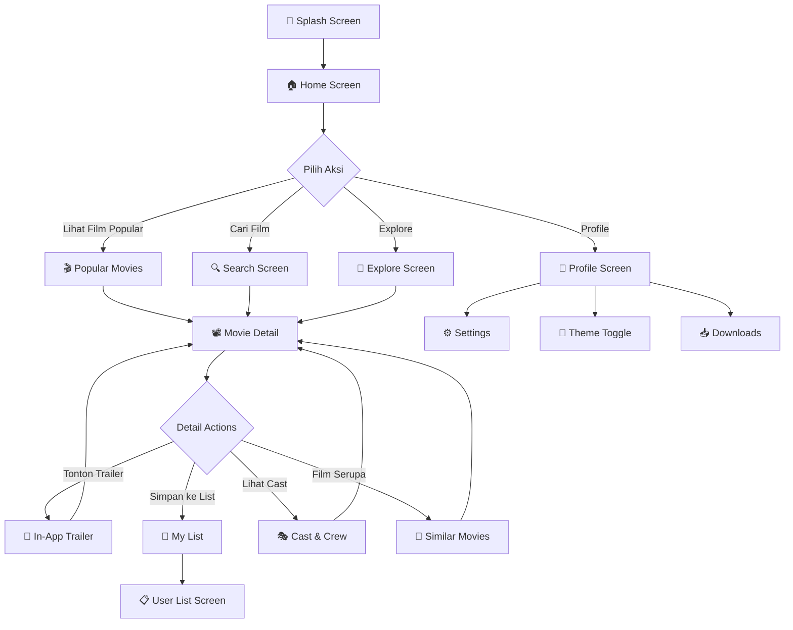
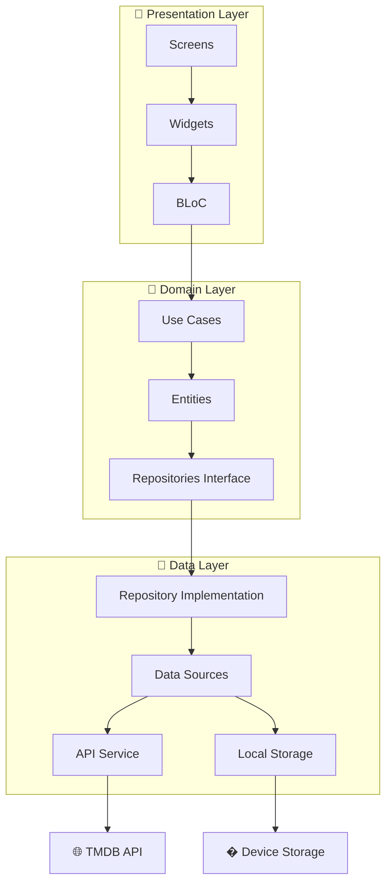
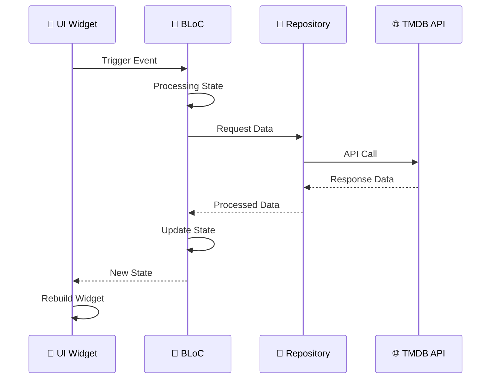
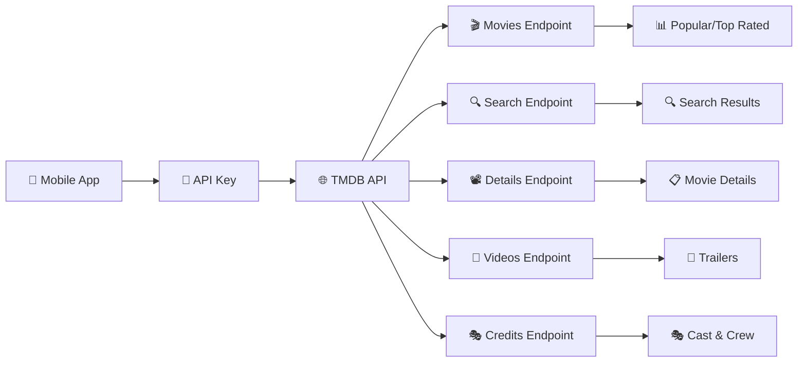

# 🎬 Movie UI Application

<div align="center">


### 🚀 Aplikasi Movie UI Modern dengan Flutter & TMDB API
*Pengalaman Menonton Film Terdepan dengan Teknologi Terkini*

[](https://flutter.dev/)
[](https://dart.dev/)
[](https://www.themoviedb.org/)
[](https://bloclibrary.dev/)
[](LICENSE)

**⭐ Beri Star jika project ini bermanfaat! ⭐**

</div>

---

## 📋 Daftar Isi

- [🎯 Tentang Proyek](#-tentang-proyek)
- [✨ Fitur Unggulan](#-fitur-unggulan)
- [🎮 User Flow](#-user-flow)
- [🏗️ Arsitektur Sistem](#️-arsitektur-sistem)
- [📁 Struktur Folder](#-struktur-folder)
- [📱 Screenshots](#-screenshots)
- [🛠️ Instalasi](#️-instalasi)
- [🚀 Quick Start](#-quick-start)
- [⚡ Teknologi](#-teknologi)
- [🤝 Kontribusi](#-kontribusi)

---

## 🎯 Tentang Proyek

**Movie UI Application** adalah aplikasi mobile modern yang dibangun dengan **Flutter** dan terintegrasi dengan **TMDB (The Movie Database) API**. Aplikasi ini menyediakan pengalaman menonton film yang luar biasa dengan antarmuka yang elegan dan fitur-fitur canggih.

### 🌟 Keunggulan Utama
- 🎨 **UI/UX Modern**: Desain antarmuka yang elegan dan user-friendly
- ⚡ **Performa Tinggi**: Optimasi dengan BLoC pattern dan caching gambar
- 🌐 **Data Real-time**: Integrasi langsung dengan TMDB API
- 📱 **Multi-platform**: Mendukung Android, iOS, dan Web
- 🎥 **Fitur Lengkap**: Dari pencarian hingga menonton trailer in-app

---

## ✨ Fitur Unggulan

### 🎬 **Eksplorasi Film**
- **🔥 Film Trending**: Header carousel otomatis dengan 10 film terpopuler
- **🔍 Pencarian Canggih**: Cari film dengan berbagai filter
- **� Kategori Lengkap**: Popular, Top Rated, Now Playing, Upcoming
- **🎨 Tema Adaptif**: Mode Dark/Light sesuai preferensi

### 📽️ **Detail Film Komprehensif**
- **📊 Informasi Lengkap**: Rating IMDB, genre, durasi, tanggal rilis
- **🎭 Cast & Crew**: Daftar lengkap pemeran dan kru produksi
- **🎥 Video Trailer**: Tonton trailer langsung dalam aplikasi dengan WebView
- **🎪 Rekomendasi**: Film serupa dan yang direkomendasikan
- **💾 My List**: Simpan film favorit ke daftar pribadi
- **📥 Download Tracker**: Kelola film yang sudah didownload

### 🏗️ **Keunggulan Teknis**
- **🧩 Clean Architecture**: Pemisahan logic dengan BLoC pattern
- **🔄 State Management**: BLoC untuk mengelola state aplikasi
- **🌐 API Integration**: Real-time data dari TMDB API
- **📱 Responsive Design**: UI adaptif untuk berbagai ukuran layar
- **⚡ Performance**: Lazy loading dan image caching

---

## 🎮 User Flow



### 📋 Penjelasan User Flow

1. **🚀 Splash Screen**: Pembuka aplikasi dengan animasi Lottie
2. **🏠 Home Screen**: Halaman utama dengan carousel film trending
3. **🔍 Search & Explore**: Pencarian film dengan filter advanced
4. **📽️ Movie Detail**: Informasi lengkap film dengan berbagai aksi
5. **🎥 Trailer Viewing**: Menonton trailer langsung dalam aplikasi
6. **💾 Personal Lists**: Mengelola koleksi film pribadi
7. **👤 Profile Management**: Pengaturan tema dan preferensi

---

## 🏗️ Arsitektur Sistem

### 📐 Clean Architecture Pattern



### �🔄 State Management Flow



### 🌐 API Data Flow



---

## � Struktur Folder

Struktur folder aplikasi ini dirancang menggunakan **Clean Architecture** dengan pemisahan yang jelas antara presentation, domain, dan data layer.

```
📁 movie_ui_application/
├── 📱 android/                     # Konfigurasi platform Android
│   ├── app/
│   │   ├── build.gradle.kts        # Build configuration Android
│   │   └── google-services.json   # Firebase configuration
│   └── gradle/                     # Gradle wrapper files
├── 🎨 assets/
│   └── images/                     # Asset gambar aplikasi
│       ├── logo_app.svg           # Logo aplikasi
│       ├── splash_screen.png      # Gambar splash screen
│       ├── icon_*.svg             # Icon navigasi dan UI
│       └── *.png                  # Gambar poster dan background
├── 📚 lib/
│   ├── 🚀 main.dart               # Entry point aplikasi
│   ├── 📱 movie_app.dart          # Root widget aplikasi
│   ├── 🔧 core/                   # Core components & utilities
│   │   ├── auth/                  # Authentication logic
│   │   ├── component/             # Reusable components
│   │   ├── data/
│   │   │   ├── models/            # Data models
│   │   │   │   ├── movie_detail.dart    # Model detail film
│   │   │   │   └── tmdb_movie.dart      # Model film TMDB
│   │   │   └── services/          # API services
│   │   │       └── movie_detail_service.dart # Service detail film
│   │   ├── helper/
│   │   │   └── storage_helper.dart # Local storage helper
│   │   ├── network/
│   │   │   └── api_constants.dart # API configuration & endpoints
│   │   ├── screens/
│   │   │   └── splash_screen.dart # Splash screen dengan Lottie
│   │   ├── theme/                 # Tema aplikasi
│   │   │   ├── app_color.dart     # Definisi warna
│   │   │   ├── app_theme.dart     # Konfigurasi tema
│   │   │   ├── app_text_style.dart # Style text
│   │   │   └── controller/        # Theme controller
│   │   ├── utils/                 # Utilities & constants
│   │   │   ├── app_string.dart    # String constants
│   │   │   └── app_images_assets.dart # Image assets
│   │   └── widgets/               # Common widgets
│   │       └── custome_app_bar.dart # Custom app bar
│   └── 🎬 feature/               # Feature modules
│       ├── 📥 download/          # Download management
│       │   └── presentation/
│       │       ├── screens/      # Download screens
│       │       └── widgets/      # Download widgets
│       ├── 🔍 explore/           # Search & explore
│       │   └── presentation/
│       │       ├── views/        # Explore views
│       │       └── widgets/      # Search widgets
│       ├── 🏠 home/              # Home page
│       │   ├── data/
│       │   │   └── bloc/         # Home BLoC
│       │   │       ├── movie_bloc.dart    # Movie BLoC
│       │   │       └── movie_event.dart   # Movie events
│       │   └── presentation/
│       │       ├── views/        # Home views
│       │       └── widget/       # Home widgets
│       ├── 📽️ movie_detail/      # Movie detail
│       │   ├── data/
│       │   │   └── bloc/         # Movie detail BLoC
│       │   │       ├── movie_detail_bloc.dart   # Detail BLoC
│       │   │       └── movie_detail_event.dart  # Detail events
│       │   └── presentation/
│       │       ├── screens/      # Detail screens
│       │       │   ├── movie_detail_screen.dart      # Main detail
│       │       │   ├── simple_trailer_screen.dart    # Trailer options
│       │       │   └── in_app_trailer_screen.dart    # In-app trailer
│       │       └── widgets/      # Detail widgets
│       │           ├── cast_section.dart        # Cast & crew
│       │           ├── video_section.dart       # Video trailers
│       │           └── similar_movies_section.dart # Similar movies
│       ├── 👤 profile/           # User profile
│       │   ├── data/
│       │   │   └── model/        # Profile models
│       │   └── presentation/
│       │       ├── screens/      # Profile screens
│       │       ├── views/        # Profile views
│       │       └── widgets/      # Profile widgets
│       ├── 🔐 sign_in/           # Authentication
│       └── 📋 user_list/         # User's movie list
├── 🧪 test/                      # Unit & widget tests
├── 🌐 web/                       # Web platform files
├── 🖥️ windows/                   # Windows platform files
├── 📄 pubspec.yaml               # Dependencies & configuration
├── 🔥 firebase.json              # Firebase configuration
└── 📖 README.md                  # Dokumentasi project
```

### 📋 Penjelasan Struktur

#### 🔧 **Core Layer**
- **`models/`**: Definisi struktur data untuk API response
- **`services/`**: Layer service untuk komunikasi dengan API
- **`network/`**: Konfigurasi API endpoints dan constants
- **`theme/`**: Manajemen tema dark/light dengan BLoC
- **`widgets/`**: Komponen UI yang dapat digunakan ulang

#### 🎬 **Feature Layer**
Setiap feature memiliki struktur yang konsisten:
- **`data/bloc/`**: State management dengan BLoC pattern
- **`presentation/screens/`**: Halaman utama feature
- **`presentation/views/`**: Sub-komponen halaman
- **`presentation/widgets/`**: Widget spesifik feature

#### 🎯 **Key Features**
- **Home**: Menampilkan film trending dengan auto-slide carousel
- **Movie Detail**: Detail lengkap film dengan cast, trailer, dan rekomendasi
- **Explore**: Pencarian dan filter film advanced
- **Profile**: Manajemen pengaturan user dan tema
- **Download**: Tracking film yang sudah didownload
- **User List**: Daftar film favorit user

---

## � Screenshots

<div align="center">

| 🏠 Beranda | 📽️ Detail Film | 🔍 Pencarian |
|-------------|---------------|----------------|
|  |  |  |

| 🌙 Tema Gelap | ☀️ Tema Terang | 🎥 Trailer In-App |
|------------|-------------|--------------|
|  |  |  |

</div>

---

## 🛠️ Instalasi

### 📋 **Prasyarat**

Pastikan Anda telah menginstal:
- [Flutter](https://flutter.dev/) (versi 3.24+)
- [Dart](https://dart.dev/) (versi 3.5+)
- Android Studio atau VS Code
- Git untuk version control

```bash
# Cek versi Flutter
flutter --version

# Cek doctor untuk memastikan setup
flutter doctor
```

### 🚀 **Quick Start**

1. **Clone Repository**
   ```bash
   git clone https://github.com/Iam-Rmdhn/movie_ui_application.git
   cd movie_ui_application
   ```

2. **Install Dependencies**
   ```bash
   flutter pub get
   ```

3. **Setup TMDB API Key** 🔑
   
   - Daftar di [TMDB](https://www.themoviedb.org/signup) (gratis)
   - Buat API key di [API Settings](https://www.themoviedb.org/settings/api)
   - Edit file `lib/core/network/api_constants.dart`:
   
   ```dart
   class ApiConstants {
     static const String apiKey = 'your_tmdb_api_key_here'; // 🔴 GANTI INI!
     static const String baseUrl = 'https://api.themoviedb.org/3';
     // ... rest of the configuration
   }
   ```

4. **Jalankan Aplikasi**
   ```bash
   # Debug mode
   flutter run
   
   # Release mode
   flutter run --release
   
   # Untuk platform spesifik
   flutter run -d chrome        # Web
   flutter run -d windows       # Windows
   flutter run -d android       # Android
   ```

### 🔧 **Konfigurasi Advanced**

#### Firebase Setup (Optional)
Jika ingin menggunakan fitur analytics atau crashlytics:

1. Buat project di [Firebase Console](https://console.firebase.google.com/)
2. Download `google-services.json` untuk Android
3. Download `GoogleService-Info.plist` untuk iOS
4. Letakkan file di folder yang sesuai

#### Platform Specific Setup

**Windows:**
```bash
flutter config --enable-windows-desktop
flutter create --platforms=windows .
```

**Web:**
```bash
flutter config --enable-web
flutter create --platforms=web .
```

---

## ⚡ Teknologi

### 🛠️ **Tech Stack**

| Kategori | Teknologi | Versi | Keterangan |
|----------|-----------|-------|------------|
| **Framework** | Flutter | 3.24+ | Cross-platform UI framework |
| **Language** | Dart | 3.5+ | Programming language |
| **State Management** | BLoC | 8.1+ | Business Logic Component |
| **API** | TMDB API | v3 | Movie database |
| **HTTP Client** | http | 1.2+ | API communication |
| **Image Caching** | cached_network_image | 3.3+ | Optimized image loading |
| **Animations** | Lottie | 3.1+ | Smooth animations |
| **Video Player** | WebView Flutter | 4.8+ | In-app video player |
| **Storage** | SharedPreferences | 2.2+ | Local data persistence |

### 📦 **Dependencies Utama**

```yaml
dependencies:
  flutter:
    sdk: flutter
  
  # State Management
  flutter_bloc: ^8.1.6
  equatable: ^2.0.5
  
  # Network & API
  http: ^1.2.2
  cached_network_image: ^3.3.1
  
  # UI & Animations  
  lottie: ^3.1.2
  webview_flutter: ^4.8.0
  
  # Utilities
  shared_preferences: ^2.2.3
  url_launcher: ^6.3.0
```

### 🏗️ **Arsitektur & Pattern**

- **Clean Architecture**: Pemisahan layer presentation, domain, dan data
- **BLoC Pattern**: Reactive state management
- **Repository Pattern**: Abstraksi data sources
- **Dependency Injection**: Loose coupling antar komponen
- **SOLID Principles**: Maintainable dan scalable code

---

## 🤝 Kontribusi

Kami menyambut kontribusi dari komunitas developer! Mari bergabung membangun aplikasi movie terbaik dengan Flutter.

### 🌟 **Cara Berkontribusi**

#### 🐛 **Bug Reports**
Menemukan bug? Laporkan dengan detail:
```bash
# Template bug report
- Deskripsi bug
- Langkah reproduksi
- Screenshot/video (jika ada)
- Device/platform info
- Log error
```

#### 💡 **Feature Requests**
Punya ide fitur baru? Jelaskan dengan detail:
- Deskripsi fitur
- Use case
- Mockup UI (jika ada)
- Prioritas

#### � **Code Contributions**

1. **Fork & Clone**
   ```bash
   git fork https://github.com/Iam-Rmdhn/movie_ui_application.git
   git clone https://github.com/yourusername/movie_ui_application.git
   cd movie_ui_application
   ```

2. **Create Feature Branch**
   ```bash
   git checkout -b feature/amazing-feature
   git checkout -b fix/bug-fix
   git checkout -b docs/update-readme
   ```

3. **Development Guidelines**
   ```bash
   # Install dependencies
   flutter pub get
   
   # Run tests
   flutter test
   
   # Check code quality
   flutter analyze
   
   # Format code
   dart format .
   ```

4. **Commit & Push**
   ```bash
   git add .
   git commit -m "feat: tambah fitur amazing"
   git push origin feature/amazing-feature
   ```

5. **Create Pull Request**
   - Berikan deskripsi yang jelas
   - Referensikan issue terkait
   - Tambahkan screenshot jika ada perubahan UI
   - Pastikan semua test passing

### 📋 **Development Standards**

#### 🎯 **Code Quality**
- Ikuti [Effective Dart](https://dart.dev/guides/language/effective-dart) guidelines
- Gunakan meaningful variable names
- Tambahkan comments untuk logic kompleks
- Write unit tests untuk business logic

#### 🏗️ **Architecture Guidelines**
- Ikuti Clean Architecture pattern
- Gunakan BLoC untuk state management
- Pisahkan UI logic dari business logic
- Implementasi repository pattern untuk data layer

#### 🎨 **UI/UX Guidelines**
- Konsisten dengan design system
- Support both dark/light theme
- Responsive untuk semua screen size
- Accessibility-friendly

### 🏆 **Contributors**

Terima kasih untuk semua kontributor yang telah membantu project ini:

<div align="center">

| Contributor | Role | Contribution |
|-------------|------|--------------|
| [@Iam-Rmdhn](https://github.com/Iam-Rmdhn) | Lead Developer | Initial development, architecture design |
| [You?](https://github.com/Iam-Rmdhn/movie_ui_application) | Contributor | Your awesome contribution! |

</div>

---

## 🛠️ Troubleshooting

### ❓ **Masalah Umum & Solusi**

#### 🔑 **API Key Issues**
```bash
❌ Error: Failed to load movies (401 Unauthorized)
✅ Solution: 
   1. Pastikan API key TMDB valid
   2. Check file lib/core/network/api_constants.dart
   3. Restart aplikasi setelah update API key
```

#### 🌐 **Network Issues**
```bash
❌ Error: Network request failed / Timeout
✅ Solution:
   1. Check koneksi internet
   2. Disable VPN jika ada
   3. Check firewall settings
   4. Coba restart aplikasi
```

#### 🔧 **Build Issues**
```bash
❌ Error: Gradle build failed / Pod install failed
✅ Solution:
   flutter clean
   flutter pub get
   flutter run
```

#### 📱 **Platform Specific**
```bash
# Windows Desktop
flutter config --enable-windows-desktop
flutter create --platforms=windows .

# Web
flutter config --enable-web
flutter create --platforms=web .

# Jika ada masalah permissions Android
flutter clean
cd android
./gradlew clean
cd ..
flutter run
```

### 🆘 **Need Help?**

- 📖 **Documentation**: Baca README ini dengan teliti
- 🐛 **Bug Report**: [Create Issue](https://github.com/Iam-Rmdhn/movie_ui_application/issues)
- 💬 **Discussion**: [GitHub Discussions](https://github.com/Iam-Rmdhn/movie_ui_application/discussions)
- 📧 **Email**: Contact maintainer

---

## 📄 Lisensi

Proyek ini dilisensikan di bawah **MIT License** - lihat file [LICENSE](LICENSE) untuk detailnya.

```
MIT License

Copyright (c) 2025 Movie UI Application

Permission is hereby granted, free of charge, to any person obtaining a copy
of this software and associated documentation files (the "Software"), to deal
in the Software without restriction, including without limitation the rights
to use, copy, modify, merge, publish, distribute, sublicense, and/or sell
copies of the Software, and to permit persons to whom the Software is
furnished to do so, subject to the following conditions:

The above copyright notice and this permission notice shall be included in all
copies or substantial portions of the Software.
```

---

<div align="center">

### 🌟 **Terima kasih telah menggunakan Movie UI Application!**

**Dibuat dengan ❤️ menggunakan Flutter**

[](https://flutter.dev)
[](https://www.themoviedb.org/)
[](https://dart.dev)

**⭐ Jangan lupa beri star jika project ini bermanfaat! ⭐**

[⬆️ Kembali ke atas](#-movie-ui-application)

</div>
